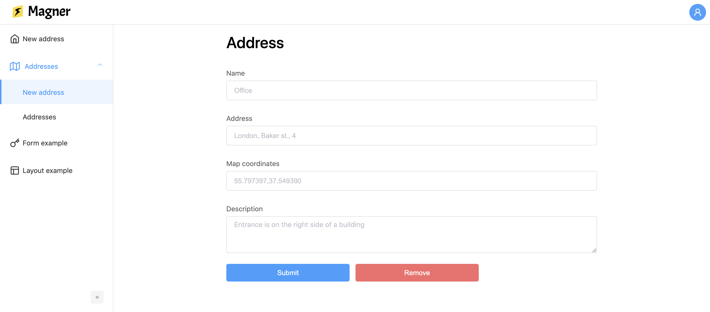

# Magner

Universal admin panel magnetic to any backend. Magner provides a set of tools to bootstrap
an admin panel website built with [Vue 3](https://v3.vuejs.org/) and [Element Plus](https://element-plus.org/en-US/). All you
need to do is writing JSON configurations and backend connectors. 

Magner supports authentication, role management, internationalization and CRUD-operations with entities of any type.



## Installation

You can start your Magner project app with the following command:

```bash
pnpm create magner
```

It copies a project template with usage examples into your local machine. 

Proceed to [the configuration](./configuration/) of your project.

## Problems and troubleshooting

> What is this feature for? How should I use this property in the config?

If you ask yourself similar questions while using Magner, please, check the structured documentation links
from above. It explains main concepts and shows the usage of different configurations.

If you need to dive deeper than the documentation, check the TypeScript interfaces: hover over the
property in the config and do "Go to definition" in your IDE: CMD+Click in Webstorm, Ctrl+Click in VS Code.

As a last resort, you can open an issue (or discussion) in the repo or contact [the maintainer](https://t.me/vanishmax)
with your problem or proposal.
